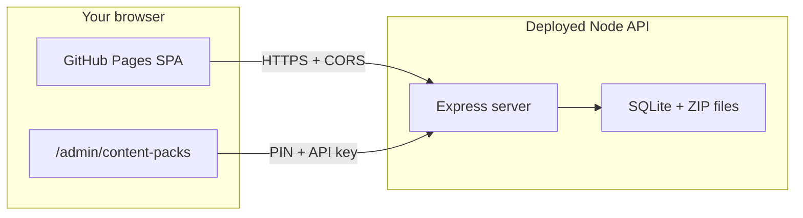

# First-Time Wing Administrator Runbook (GitHub Pages + API)

Plain-language checklist for hosting the crew app on **GitHub Pages**, deploying the **Node API** once, signing into the **Wing Administrator Console**, and creating an **empty** ForeFlight content pack for a new survey (for example a blended **IR107 / VR108** route).

**Audience:** Wing content-pack maintainer or coordinator doing this for the first time. For API details and PIN policy, see also [CONTENT_PACK_ADMIN.md](./CONTENT_PACK_ADMIN.md) and [API_HOSTING.md](./API_HOSTING.md).

**Print:** Open this file in your editor or on GitHub and use **Print → Save as PDF**.

---

## Live URLs (this repository)

| Resource | URL |
|----------|-----|
| Crew app (GitHub Pages) | https://gvdurfee.github.io/HighTowers-Web/ |
| Wing Administrator Console | https://gvdurfee.github.io/HighTowers-Web/admin/content-packs |

Replace API hostnames below with your deployed origin (for example `https://hightowers-api.fly.dev`).

---

## How the pieces fit together

GitHub Pages serves **only** the static Vite build. The Express app under `server/` holds content packs (SQLite + ZIP files), validates the **Wing Administrator PIN**, and provides MTR and map proxy routes.



| Piece | What it does | Where you configure it |
|-------|----------------|------------------------|
| GitHub Pages | Serves the built React app | Push to `main`; workflow [`.github/workflows/pages.yml`](../.github/workflows/pages.yml) |
| Node API | Content packs, admin PIN, MTR, map proxy | Fly.io, Render, Railway, or wing host; [API_HOSTING.md](./API_HOSTING.md) |
| `VITE_API_BASE_URL` | Bakes API origin into the Pages build | GitHub → Settings → Secrets and variables → Actions → **Variables** |
| `CONTENT_PACK_ADMIN_PIN` | Human sign-in for admin console | **API server only** (not GitHub) |
| `CONTENT_PACK_API_KEY` | Authorizes `/api/content-packs/*` | **API server** + **this browser** (see Part 3) |
| `CORS_ORIGINS` | Allows the Pages site to call the API | API server; include `https://gvdurfee.github.io` |

---

## Part 1 — One-time: deploy the Node API

### 1.1 Choose a host

- **Recommended:** [Fly.io](https://fly.io) using [`server/Dockerfile`](../server/Dockerfile) — see [API_HOSTING.md](./API_HOSTING.md).
- **Alternative:** [Render](https://render.com) — Web Service, repository root directory **`server`**, build `npm ci`, start `npm start`.
- **Alternative (interim training):** [Railway](https://railway.com) — deploy from GitHub, root directory **`server`**, start `npm start`, volume on `/app/.mtr-cache` — full steps in [API_HOSTING.md](./API_HOSTING.md#railway-example).

### 1.2 Create secrets (store in a password manager)

Generate and record:

1. **`CONTENT_PACK_API_KEY`** — long random string (32+ characters).
2. **`CONTENT_PACK_ADMIN_PIN`** — PIN for the admin sign-in screen.
3. **Mapbox token** — `MAPBOX_ACCESS_TOKEN` or `VITE_MAPBOX_ACCESS_TOKEN` (PDF/map features on the server).

Optional for production:

- **`CONTENT_PACK_ADMIN_SECRET`** — at least 16 characters so admin sessions survive API restarts ([CONTENT_PACK_ADMIN.md](./CONTENT_PACK_ADMIN.md) §4).

### 1.3 Deploy and set environment variables

Deploy from **`HighTowers-Web/server/`**. Set at minimum:

| Variable | Notes |
|----------|--------|
| `CORS_ORIGINS` | `https://gvdurfee.github.io` — origin only, no path |
| `CONTENT_PACK_API_KEY` | Same value you will store in the browser (Part 3) |
| `CONTENT_PACK_ADMIN_PIN` | Wing Administrator PIN |
| `MAPBOX_ACCESS_TOKEN` or `VITE_MAPBOX_ACCESS_TOKEN` | Mapbox access token |
| `CONTENT_PACK_DATA_DIR` | Optional; default `./data/content-packs` on the server |

Restart or redeploy after changing environment variables.

### 1.4 Smoke-test the API

```bash
curl -sS -H "X-API-Key: YOUR_CONTENT_PACK_API_KEY" \
  "https://YOUR-API-HOST/api/content-packs"
```

(Replace `YOUR-API-HOST` with your Fly, Render, or Railway HTTPS origin, e.g. `hightowers-api.fly.dev` or `hightowers-api.up.railway.app`.)

Expect JSON like `{ "packs": [ ... ] }` (possibly an empty list), not a connection or auth error.

---

## Part 2 — One-time: connect GitHub Pages to the API

### 2.1 GitHub repository settings

Repository: **gvdurfee/HighTowers-Web**

1. **Settings → Secrets and variables → Actions**

   **Secret (maps):**

   - `VITE_MAPBOX_ACCESS_TOKEN` — your Mapbox token

   **Variable (API):**

   - `VITE_API_BASE_URL` = `https://YOUR-API-HOST` (e.g. `https://hightowers-api.fly.dev` or `https://hightowers-api.up.railway.app`)
   - **Origin only** — no `/api` suffix, no trailing path.

2. **Settings → Pages**

   - Source: **GitHub Actions** (workflow deploys on push to `main`).

### 2.2 Rebuild Pages

Changing the variable does not update the live site until a new build runs.

- Push a commit to `main`, **or**
- **Actions → Deploy to GitHub Pages → Run workflow**

Wait for a green workflow run.

### 2.3 Verify

1. Open https://gvdurfee.github.io/HighTowers-Web/admin/content-packs
2. Before sign-in, you should **not** see amber **“Hosted API not configured for this build.”**
3. If sign-in shows red text about GitHub Pages and `API_HOSTING.md`, check `VITE_API_BASE_URL`, Pages rebuild, `CORS_ORIGINS`, and `CONTENT_PACK_ADMIN_PIN` on the API.

---

## Day-one Railway + pilot feedback loop

Use this when **Railway** hosts the API for **interim training** (outside official CAP web hosting) and pilots use the **same GitHub Pages URL** every time.

### One-time Railway setup

1. Sign up at [railway.com](https://railway.com) and connect your **GitHub** account.
2. **New Project → Deploy from GitHub repo** → **HighTowers-Web**.
3. Service **Settings:** root directory **`server`**, start **`npm start`**.
4. **Variables:** at minimum `CORS_ORIGINS=https://gvdurfee.github.io` (plus Mapbox and content-pack vars from Part 1).
5. **Volumes:** mount **`/app/.mtr-cache`** so NASR downloads survive redeploys.
6. **Networking → Generate Domain** → copy the HTTPS origin (e.g. `https://hightowers-api.up.railway.app`).
7. Set GitHub **`VITE_API_BASE_URL`** to that origin (Part 2) and rebuild Pages.

Full detail: [API_HOSTING.md § Railway](./API_HOSTING.md#railway-example).

### Two deploys, one pilot bookmark

| You change | What redeploys | Pilots see |
|------------|----------------|------------|
| `src/` (UI, coordinator console, etc.) | GitHub Pages (~1 min after push to `main`) | Same URL; refresh after the Actions workflow is green |
| `server/` (MTR, width API, content packs) | Railway (~1–3 min after push to `main`) | Same URL; API behavior updates without a new bookmark |

Pilots always open **https://gvdurfee.github.io/HighTowers-Web/** — not the Railway hostname.

### Feedback loop with remote users

1. Agree on a change (call, email, etc.).
2. Develop locally with `npm run dev:all` until it looks right.
3. **Push to `main`** when pilots should try it.
4. Wait for **Deploy to GitHub Pages** (and Railway, if `server/` changed) to finish.
5. Tell pilots: *“Refresh the app”* (hard refresh if the UI looks stale).

You do **not** need Railway running on your laptop for day-to-day coding. Railway is for **shared** access; local dev uses the Vite proxy to port 3001.

### Day-one smoke checks for pilots

- Crew app loads at the Pages URL.
- **Coordinator Survey Console** (from a flight plan) loads NASR width lines — confirms Railway + `VITE_API_BASE_URL` + CORS.
- Wing admin and content packs work if you use those features (Part 3 onward).

---

## Part 3 — One-time per browser: Content Pack API key

The admin console sends **`X-API-Key`** on inventory and publish requests. The Pages build does **not** embed this key (by design). Use the same value as `CONTENT_PACK_API_KEY` on the server.

1. Open the admin URL on GitHub Pages.
2. Open **Developer Tools → Console**.
3. Run (replace with your key):

   ```javascript
   localStorage.setItem('hightowers.contentPackApiKey', 'YOUR_CONTENT_PACK_API_KEY');
   ```

4. Reload the page.

After sign-in, the yellow **“No Content Pack API key”** banner should be gone. Uploads and inventory will fail without this step.

For local development only, you may set `VITE_CONTENT_PACK_API_KEY` in `.env` instead ([`.env.example`](../.env.example)).

---

## Part 4 — First-time admin: empty pack (example IR107 / VR108)

### 4.1 Sign in

1. https://gvdurfee.github.io/HighTowers-Web/admin/content-packs
2. Enter the wing administrator **PIN** (`CONTENT_PACK_ADMIN_PIN` on the API server).
3. Click **Sign in**. Session TTL is about **four hours** in that browser tab.

| Error | Action |
|-------|--------|
| **503** admin not configured | Set `CONTENT_PACK_ADMIN_PIN` on API; restart |
| **401** bad PIN | Fix PIN on server; restart |
| **429** too many attempts | Wait one minute |

### 4.2 Blended route labeling (IR107 + VR108)

**Create empty pack** accepts **one numeric route** only. The server creates a folder such as `IR107_content_pack/` (from the route number you enter).

| Field | Suggested first attempt | Notes |
|-------|-------------------------|--------|
| **Route number** | `107` or `108` | Primary route for pack metadata and default tower suffixes (`107A`, `107B`, …). Adjust after field testing if needed. |
| **Display name** | e.g. `IR107 / VR108 Blended Route Reported Towers` | ForeFlight pack name |
| **Organization name** | e.g. `NM Wing Civil Air Patrol` | Optional |
| **Abbreviation** | e.g. `IR107-VR108.V1` | Max **32** characters on server |

Waypoint codes during the mission may still reference **both** IR and VR segments; the app can infer route numbers from waypoint names when crews apply towers. Blended-route labeling may need code tweaks during testing—capture examples if behavior is wrong.

### 4.3 Create the empty pack

1. Section **“Create empty pack for a new route.”**
2. Fill required **Route number** and optional display fields.
3. Submit and confirm the pack appears in **Inventory** (CSV path like `IR107_content_pack/navdata/user_waypoints.csv`, revision **1**, **0** waypoints).

See [CONTENT_PACK_ADMIN.md](./CONTENT_PACK_ADMIN.md) §6 for what the server stores.

### 4.4 Download the baseline ZIP for crews

The admin UI does not include a **Download** button. Use the pack **id** from Inventory (full UUID appears in the **Delete** confirmation dialog).

**Terminal (recommended):**

```bash
export API_KEY='YOUR_CONTENT_PACK_API_KEY'
export API_BASE='https://YOUR-API-HOST.fly.dev'
export PACK_ID='paste-full-uuid-from-inventory'

curl -fsSL -H "X-API-Key: $API_KEY" \
  "$API_BASE/api/content-packs/$PACK_ID/export" \
  -o "IR107_content_pack.zip"
```

**Server filesystem** (if you have host access): `data/content-packs/<PACK_ID>/baseline.zip` — back up together with the SQLite file ([CONTENT_PACK_ADMIN.md](./CONTENT_PACK_ADMIN.md) §9).

### 4.5 Wing folder handoff

Per [content-pack-wing-workflow.md](./content-pack-wing-workflow.md):

1. Place the ZIP in **Content Packs for Flight Planning** (coordinator provides the current path each season).
2. Tell crews to import into **ForeFlight** before the survey.
3. At mission close-out, crews use **Export Reported Data** (browser-only ZIP; no server upload required).

Crews do **not** need the admin URL for normal missions.

---

## Part 5 — Updating the app on GitHub Pages (ongoing)

| Step | Action |
|------|--------|
| 1 | Commit and push to **`main`** |
| 2 | Wait for **Deploy to GitHub Pages** workflow |
| 3 | Hard-refresh https://gvdurfee.github.io/HighTowers-Web/ |

Redeploy the **API** only when server code or server environment variables change.

**GitHub changes:**

| Change | Action |
|--------|--------|
| New API hostname | Update `VITE_API_BASE_URL`; rerun Pages workflow |
| New Mapbox token | Update `VITE_MAPBOX_ACCESS_TOKEN`; rerun workflow |
| New API key or PIN | Update API server; refresh browser `localStorage` if API key changed |

---

## Part 6 — After the survey (crew vs administrator)

| Role | Task | Server required? |
|------|------|-------------------|
| **Crew** | **Export Reported Data** → PDF + optional updated ZIP → Wing **Updated Content Packs** | No |
| **Administrator** | Optional centralized publish/upload via admin console | Only if using server library |

For a **first** pack on a new route, the critical admin steps are: **create empty → export baseline → place in flight-planning folder**.

---

## Troubleshooting

| Symptom | Likely cause | Fix |
|---------|----------------|-----|
| Red: *GitHub Pages serves only the static web app…* | API URL missing, CORS, or PIN | `VITE_API_BASE_URL`, redeploy Pages; `CORS_ORIGINS`; `CONTENT_PACK_ADMIN_PIN` |
| Amber: *Hosted API not configured* | Empty `VITE_API_BASE_URL` in build | Set GitHub variable; rerun workflow |
| Yellow: *No Content Pack API key* | Browser missing key | Part 3 `localStorage` |
| Create empty fails | Missing API key or session | Part 3; sign in again |
| Empty inventory after create | Wrong API key or host | Part 1.4 curl test |

---

## Related documentation

| Document | Use when |
|----------|----------|
| [API_HOSTING.md](./API_HOSTING.md) | Deploy Node API; `VITE_API_BASE_URL`; `CORS_ORIGINS` |
| [CONTENT_PACK_ADMIN.md](./CONTENT_PACK_ADMIN.md) | PIN, backups, bulk import, delete packs |
| [CONTENT_PACK_API.md](./CONTENT_PACK_API.md) | Endpoints, export, create-empty JSON |
| [content-pack-wing-workflow.md](./content-pack-wing-workflow.md) | Wing folders; crew Export workflow |
| [SMOKE_TEST.md](./SMOKE_TEST.md) | Post-deploy Pages checks |

---

## Ready-for-survey checklist

**Infrastructure**

- [ ] Node API deployed and reachable
- [ ] `CORS_ORIGINS` includes `https://gvdurfee.github.io`
- [ ] `CONTENT_PACK_API_KEY` and `CONTENT_PACK_ADMIN_PIN` on API
- [ ] `VITE_API_BASE_URL` set; Pages workflow succeeded after setting it
- [ ] Admin page: no amber “Hosted API not configured”
- [ ] API key in browser `localStorage`

**Wing Administrator**

- [ ] Signed in at `/admin/content-packs`
- [ ] Created empty pack (route + display name for blended route if applicable)
- [ ] Exported ZIP (`curl` or server filesystem)
- [ ] ZIP in **Content Packs for Flight Planning**; crews notified

**Crew app**

- [ ] https://gvdurfee.github.io/HighTowers-Web/ loads; Map View works (Mapbox secret)
